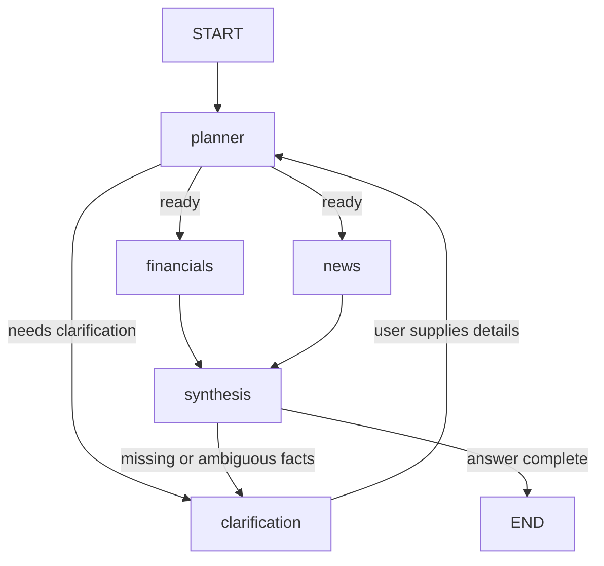

# Financial Exploration LangGraph

This is a reference design for turning the tools in `demo.ipynb` into a financial exploration workflow for Indian listed companies.

The workflow should:

1. Accept a user question such as `Compare Infosys revenue and debt with recent news`.
2. Identify the company, exchange, and requested analysis.
3. Collect structured financial facts with `get_company_financials`.
4. Collect recent financial news with `get_company_news`.
5. Synthesize a concise answer with clear source boundaries and caveats.
6. Ask for clarification or run another exploration when required information is missing.

## Flow graph



`financials` and `news` are independent after planning, so they can be modeled as parallel branches. If the first version uses a normal sequential graph, keep the same node boundaries and add parallel execution later.

## State design

Use a typed state so every node has a predictable contract:

```python
from typing import Annotated, TypedDict
from langgraph.graph.message import add_messages


class FinancialState(TypedDict, total=False):
    messages: Annotated[list, add_messages]
    user_question: str
    company_name: str
    symbol: str
    exchange: str
    financials: str
    news: str
    answer: str
    needs_clarification: bool
    clarification_question: str
```

Keep raw tool responses in `financials` and `news`. Do not overwrite them with the model's interpretation; this makes the final answer auditable and allows a later node to re-summarize the same evidence.

## Node responsibilities

### 1. `planner`

- Read the latest user message.
- Extract `company_name`, ticker `symbol`, and `exchange`.
- Default the exchange to `NS` only when the company identifier is unambiguous.
- Set `needs_clarification=True` when the company or exchange cannot be determined safely.
- Do not call external tools from this node.

For Indian Yahoo Finance tickers, the existing tool expects symbols such as `INFY.NS` or `INFY.BO`; the tool itself builds this value from `symbol` and `exchange`.

### 2. `financials`

Call the existing `get_company_financials` tool:

```python
financials = get_company_financials.invoke({
    "symbol": state["symbol"],
    "exchange": state.get("exchange", "NS"),
})
return {"financials": financials}
```

The current tool returns latest revenue, net income, operating cash flow, and total debt when those rows are available.

### 3. `news`

Call the existing `get_company_news` tool:

```python
news = get_company_news.invoke({
    "company_name": state["company_name"],
})
return {"news": news}
```

This requires `TAVILY_API_KEY` and searches the configured finance domains.

### 4. `synthesis`

Use the model to produce the final response from the question and the two collected results. The synthesis prompt should require:

- a direct answer first;
- separate sections for financial metrics and news;
- explicit `not available` wording for missing fields;
- no investment recommendation or certainty beyond the evidence;
- a note that the data is informational and may be delayed;
- clarification when the tool response is empty or malformed.

### 5. `clarification`

Return a human-readable question, for example:

> Which company and exchange should I use? Please provide a ticker such as `INFY` with `NS` or `BO`.

For a chat application, stop the graph at this node and merge the user's next message back into `messages` before routing to `planner` again.

## Reference implementation skeleton

The following is a minimal graph shape. Add it after the tool definitions in `demo.ipynb`, or move the tool definitions and this graph into a `.py` module when the workflow stabilizes.

```python
from typing import Literal
from langgraph.graph import END, START, StateGraph


def planner(state: FinancialState) -> FinancialState:
    # Replace this with a structured-output model in the real application.
    question = state["user_question"]
    return {
        "company_name": "Infosys",
        "symbol": "INFY",
        "exchange": "NS",
        "needs_clarification": False,
    }


def collect_financials(state: FinancialState) -> FinancialState:
    result = get_company_financials.invoke({
        "symbol": state["symbol"],
        "exchange": state.get("exchange", "NS"),
    })
    return {"financials": result}


def collect_news(state: FinancialState) -> FinancialState:
    result = get_company_news.invoke({
        "company_name": state["company_name"],
    })
    return {"news": result}


def synthesize(state: FinancialState) -> FinancialState:
    # Invoke a chat model here with state["user_question"],
    # state["financials"], and state["news"].
    answer = (
        f"Financials for {state['company_name']}:\n{state.get('financials', '')}\n\n"
        f"Recent news:\n{state.get('news', '')}"
    )
    return {"answer": answer}


def ask_clarification(state: FinancialState) -> FinancialState:
    return {
        "clarification_question": (
            "Which company and exchange should I use? "
            "Provide a ticker such as INFY with NS or BO."
        )
    }


def route_after_planning(
    state: FinancialState,
) -> Literal["clarification", "financials"]:
    if state.get("needs_clarification"):
        return "clarification"
    return "financials"


builder = StateGraph(FinancialState)
builder.add_node("planner", planner)
builder.add_node("financials", collect_financials)
builder.add_node("news", collect_news)
builder.add_node("synthesis", synthesize)
builder.add_node("clarification", ask_clarification)

builder.add_edge(START, "planner")
builder.add_conditional_edges(
    "planner",
    route_after_planning,
    {"clarification": "clarification", "financials": "financials"},
)
builder.add_edge("financials", "news")
builder.add_edge("news", "synthesis")
builder.add_edge("synthesis", END)
builder.add_edge("clarification", END)

graph = builder.compile()

result = graph.invoke({
    "user_question": "Summarize Infosys financials and recent news",
})
print(result["answer"])
```

## Recommended model-powered planner

The hard-coded planner above only demonstrates graph wiring. For the real workflow, define a structured schema and ask the chat model to extract it:

```python
from pydantic import BaseModel, Field


class ExplorationRequest(BaseModel):
    company_name: str | None = None
    symbol: str | None = None
    exchange: str = Field(default="NS", pattern="^(NS|BO)$")
    needs_clarification: bool
```

Use `model.with_structured_output(ExplorationRequest)` in `planner`, then copy the validated fields into `FinancialState`. This avoids relying on string parsing for ticker and exchange selection.

## Production checklist

- Load `.env` before invoking the graph; provide `TAVILY_API_KEY` for news search.
- Catch `yfinance` and Tavily failures inside tool-facing nodes and store a useful error in state.
- Validate that `symbol` contains the expected ticker format before making a request.
- Preserve the source text and retrieval date in the state when adding richer tools.
- Add a `checkpointer` and `thread_id` when clarification requires multi-turn memory.
- Never present the workflow as personalized investment advice.
- Test both successful and empty-data paths, including invalid exchanges and failed news search.
